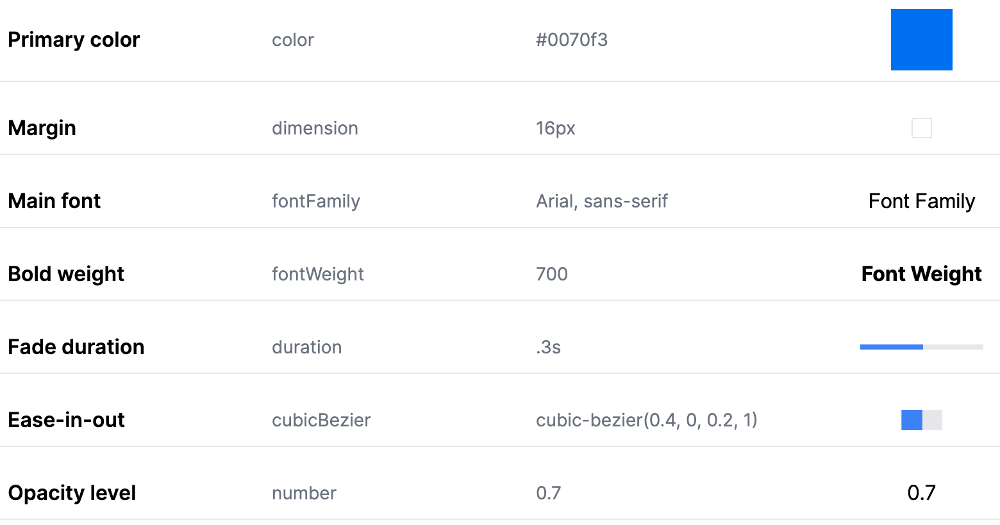

# Design Token Editor

Hello folks! Welcome to my pet project – a tool to display design tokens as outlined in the [W3C Community Group Draft](https://design-tokens.github.io/community-group/format/).

## What's this all about?

Design tokens are the tiny visual atoms (think colors, fonts, margins, etc.) that make up a design system. The idea here is to visualize these tokens in a neat little UI. The image above is an example of what you'll see when you run this project.

## The Grand Vision (and the reality...)

Ultimately, I dream of transforming this tool into a mighty editor for these design tokens. Sounds fun, right?

But, let's keep it real. My time to work on it is as rare as an undiscovered meme on the internet.

So, will this tool become the next big thing in design token management or will it join the noble league of admirable yet abandoned projects? Only time (and my motivation level) will tell. 😅

## Running the Project

1. Navigate to the project directory and run `npm install` to install the dependencies.
2. Once the installation is complete, run `npm run dev` to start the project.
3. Now, you can edit the `tokens.json` file to change the visualized design tokens.

**Note:** Currently, this project does not support [Groups](https://design-tokens.github.io/community-group/format/#groups) or [Composite Types](https://design-tokens.github.io/community-group/format/#composite-types) from the Design Tokens Community Group Draft.

## Stay Tuned!

Join me on this journey of excitement, code, occasional despair, and a lot of fun. Whether we succeed or fail, we'll do it with flair!

Happy coding! 🚀💻
